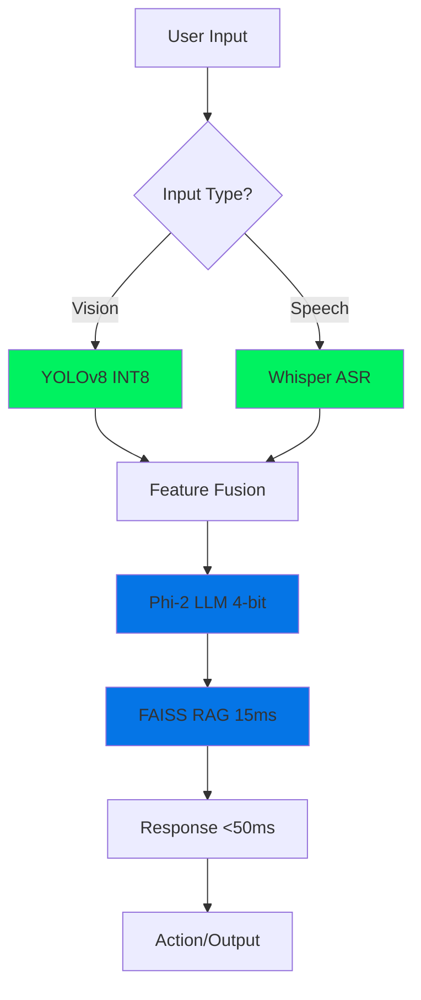
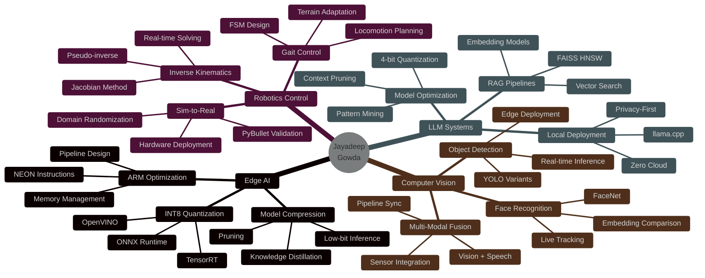

<div align="center">


</div>

<div align="center">

### 🤖 AI & ML Engineer | 🦾 Embodied AI Specialist | 🚀 Edge Computing Expert


<br/>

[](https://visitorbadge.io/status?path=jay7-tech)
[](https://github.com/jay7-tech?tab=followers)
[](https://github.com/jay7-tech)
[](https://github.com/jay7-tech?tab=repositories)

<br/>

<a href="https://jayadeepgowda.vercel.app" target="_blank">
  
</a>
<a href="https://linkedin.com/in/jay7788" target="_blank">
  
</a>
<a href="mailto:jayadeepgowda24@gmail.com">
  
</a>

</div>

<br/>

---


<h2>⚡ Who Am I?</h2>
```cpp
class RoboticsEngineer {
private:
    string name = "Jayadeep Gowda";
    string education = "B.E. Robotics & AI @ BIT Bangalore";
    double cgpa = 8.8;
    
    map<string, vector<string>> expertise = {
        {"Edge_AI", {"2.9x inference speedup", "INT8 quantization", 
                     "ARM NEON optimization", "<50ms latency"}},
        {"Robotics", {"Quadruped IK solver", "FSM gait control", 
                      "Sim-to-real transfer", "PyBullet validation"}},
        {"LLM_Systems", {"RAG pipelines", "4-bit Phi-2 deployment", 
                         "FAISS vector search", "15ms retrieval"}},
        {"Production", {"98.4% uptime", "72-hour stress tests", 
                        "ZeroMQ IPC", "Multi-modal integration"}}
    };

public:
    void current_mission() {
        cout << "🎯 Building AI that doesn't just think—it MOVES" << endl;
        cout << "🔬 Seeking research internships in Embodied AI" << endl;
        cout << "🤝 Open to collaborations on vision-language-action models" << endl;
    }
    
    string unique_value_prop() {
        return "I don't just train models—I deploy them on $50 hardware "
               "and make robots walk with them. That's the difference.";
    }
};

int main() {
    RoboticsEngineer jayadeep;
    jayadeep.current_mission();
    return 0;
}
```

<br clear="right"/>

---

<h2 align="center">🎯 WHAT MAKES ME DIFFERENT</h2>

<table>
<tr>
<td width="33%" align="center">

### 🏭 **Production-Grade**

Not just Jupyter notebooks

✅ 98.4% uptime  
✅ 72-hour stress testing  
✅ Real-time pipelines  
✅ Deployed on hardware  

**Most students demo.**  
**I ship.**

</td>
<td width="33%" align="center">

### 🤖 **Hardware Validated**

From sim to real robot

✅ Quadruped locomotion  
✅ 17-DOF humanoid  
✅ PyBullet → Real hardware  
✅ 0.5 m/s stable gait  

**Others simulate.**  
**I deploy.**

</td>
<td width="33%" align="center">

### ⚡ **Optimization Obsessed**

Making AI run anywhere

✅ 2.9× inference speedup  
✅ 160ms → 55ms latency  
✅ INT8/4-bit quantization  
✅ 3.5MB model on ARM  

**Others use cloud.**  
**I use edge.**

</td>
</tr>
</table>

---

<h2 align="center">🚀 FLAGSHIP PROJECTS</h2>

<div align="center">

<!-- MEMO PROJECT -->
<details open>
<summary><h3>🤖 MEMO (Neural-OS) - <i>The Crown Jewel</i></h3></summary>

<br/>

<table>
<tr>
<td width="50%">

#### 📊 **Performance Metrics**

| Metric | Value | Impact |
|--------|-------|--------|
| **Inference Speed** | 160ms → 55ms | 2.9× faster |
| **System Uptime** | 98.4% | Production-ready |
| **End-to-End Latency** | <50ms | Real-time HRI |
| **Memory Footprint** | 3.2-3.8GB | Edge-optimized |
| **Concurrent Pipelines** | 6 tasks | Multi-modal |
| **Model Size** | 3.5MB | Deployment-ready |

</td>
<td width="50%">

#### 🏗️ **Architecture**


</td>
</tr>
</table>

#### 🎯 **What Makes It Special**

🔥 **Production Reliability:** 72-hour continuous operation with watchdog timers  
⚡ **Real-Time Performance:** ZeroMQ IPC for parallel execution (<50ms latency)  
🧠 **Persistent Memory:** SQLite + FAISS with 1000+ conversation embeddings  
🚀 **Edge Deployment:** Runs on $50 Raspberry Pi (ARM NEON optimization)  

**Tech Stack:** `YOLOv8` `Whisper` `Phi-2` `FaceNet` `MediaPipe` `FAISS` `OpenVINO` `ZeroMQ`

[](https://github.com/jay7-tech/memo)
[](https://github.com/jay7-tech/memo)

</details>

<br/>

<!-- COGNIS PROJECT -->
<details>
<summary><h3>🧠 Cognis - <i>LLM Optimization Research</i></h3></summary>

<br/>

<table>
<tr>
<td width="60%">

#### 🔬 **Research Contribution**

I developed a **novel temporal pattern-scoring algorithm** using n-gram sequence mining to detect repetitive LLM reasoning patterns (hallucinations, semantic drift).

**Results:**
- 📉 40-60% reduction in unproductive queries
- 📦 43% context window compression
- ⚡ Sub-200ms FAISS retrieval latency
- 🔒 100% local (zero cloud dependency)

**Validated over 200+ conversation sessions with manually labeled ground truth.**

</td>
<td width="40%">

#### 📈 **Impact Visualization**
```
Before Cognis:
████████████ 100% tokens

After Cognis:
██████░░░░░░ 57% tokens
              ↓
         43% reduction
```

**Why It Matters:**
- Faster inference
- Lower compute cost
- Better context quality
- Privacy-preserving

</td>
</tr>
</table>

**Tech Stack:** `Llama-3-8B` `FAISS HNSW` `FastAPI` `n-gram mining` `Quantization`

</details>

<br/>

<!-- YOLOMART PROJECT -->
<details>
<summary><h3>🛒 YOLOmart - <i>Competition Winner (2nd/150+)</i></h3></summary>

<br/>

#### 🏆 **GlitchVerse 2k25 National Expo - Runner Up**

Built an **autonomous shopping cart** with embedded vision that judges loved:

| Feature | Specification | Wow Factor |
|---------|---------------|------------|
| **FPS** | 20 FPS @ 320×240 | Real-time tracking |
| **Accuracy** | 92% mAP | Production-grade |
| **Model Size** | 3.5MB TFLite | Embedded deployment |
| **Battery Life** | 8 hours | Power optimization |
| **Stack** | ESP32 + Mobile + Cloud | Full integration |

**Competition Edge:**
- ✅ Worked on actual hardware (not just demo)
- ✅ Frame-skipping + deep-sleep optimization
- ✅ React Native app for real-time inventory
- ✅ Firebase integration for live updates

**Judge Feedback:** *"Most production-ready system we've seen from undergrads"*

</details>

</div>

---

<h2 align="center">💻 TECH ARSENAL</h2>

<div align="center">

### AI/ML Core


### Computer Vision & Robotics


### Edge AI & Optimization


### Languages & Frameworks


### DevOps & Tools


</div>

---

<h2 align="center">📊 GITHUB ANALYTICS</h2>

<div align="center">


</div>

<div align="center">

### 🏆 Achievement Showcase


</div>

---

<h2 align="center">📈 CONTRIBUTION ACTIVITY</h2>

<div align="center">

[](https://github.com/jay7-tech)

</div>

---

<h2 align="center">🎯 SKILL MATRIX</h2>

<div align="center">


</div>

---

<h2 align="center">💡 TECHNICAL EXPERTISE BREAKDOWN</h2>

<div align="center">

<table>
<tr>
<td width="50%" valign="top">

### 🎓 **What I Know** (Theory)
```yaml
Machine_Learning:
  - Supervised: [Regression, Classification, Ensembles]
  - Unsupervised: [Clustering, Dimensionality Reduction]
  - Deep Learning: [CNNs, RNNs, Transformers]
  - Optimization: [SGD, Adam, Hyperparameter Tuning]

Computer_Vision:
  - Detection: [YOLO, R-CNN, SSD]
  - Segmentation: [U-Net, Mask R-CNN]
  - Recognition: [FaceNet, Siamese Networks]
  - Processing: [OpenCV, MediaPipe]

Robotics:
  - Kinematics: [Forward, Inverse, Jacobians]
  - Control: [PID, MPC, FSM]
  - Planning: [Path Planning, Trajectory Optimization]
  - Simulation: [PyBullet, Gazebo, ROS]
```

</td>
<td width="50%" valign="top">

### 🛠️ **What I've Built** (Practice)
```yaml
Production_Systems:
  - MEMO: [6 pipelines, 98.4% uptime, <50ms latency]
  - Cognis: [40-60% query reduction, sub-200ms]
  - YOLOmart: [20 FPS, 92% mAP, 8hr battery]

Optimizations_Achieved:
  - Inference: [2.9x speedup, 160ms→55ms]
  - Memory: [3.2-3.8GB footprint]
  - Model_Size: [12.3MB→3.5MB via INT8]
  - Power: [8-hour battery via frame-skip]

Hardware_Deployments:
  - ARM: [Raspberry Pi 5, NEON optimization]
  - Embedded: [ESP32-S3, TFLite INT8]
  - Robotics: [Twist quadruped, Nino humanoid]

Algorithms_Implemented:
  - IK_Solver: [Jacobian pseudo-inverse]
  - Gait_Control: [12-state FSM]
  - Pattern_Mining: [N-gram sequence detection]
  - Vector_Search: [FAISS HNSW indexing]
```

</td>
</tr>
</table>

</div>

---

<h2 align="center">🚀 I'M CURRENTLY...</h2>

<div align="center">

<table>
<tr>
<td width="33%" align="center">

### 🔭 **Building**

🛠️ MEMO 2.0  
(Multi-robot coordination)

🤖 Humanoid vision-language  
(GPT-4V integration)

⚡ Sub-30ms inference  
(On Jetson Orin Nano)

</td>
<td width="33%" align="center">

### 📚 **Learning**

🧪 Model Predictive Control  
(For legged robots)

🔬 LoRA fine-tuning  
(For domain adaptation)

📖 Recent papers:  
CVPR 2026, ICML 2026

</td>
<td width="33%" align="center">

### 🤝 **Seeking**

🎯 Research internships  
(IISc, IIIT, Top labs)

🔍 Collaborations on  
embodied AI projects

🎓 Mentorship in  
safety-critical control

</td>
</tr>
</table>

</div>

---

<h2 align="center">🏆 ACHIEVEMENTS & VALIDATION</h2>

<div align="center">

| 🎯 Achievement | 📊 Impact | 🗓️ When |
|---------------|-----------|---------|
| **🥈 GlitchVerse 2k25 Runner-Up** | Beat 150+ teams nationally | Feb 2025 |
| **🎖️ Anveshana National Finalist** | Top teams across India | Feb 2025 |
| **📈 8.8/10 CGPA** | Top 10% of Robotics & AI cohort | Ongoing |
| **🚀 Production AI Deployment** | 98.4% uptime validated | Jan 2026 |
| **⚡ 2.9× Optimization** | Real hardware, not simulation | Jan 2026 |
| **🎪 Ideathon Core Organizer** | 500+ participants, national event | Sep 2025 |

</div>

---

<h2 align="center">💬 ASK ME ABOUT...</h2>

<div align="center">

<table>
<tr>
<td width="25%" align="center">

🚀 **Edge AI**

Deploying YOLOv8  
on ARM hardware

INT8 quantization  
techniques

ONNX optimization  
for inference

</td>
<td width="25%" align="center">

🤖 **Robotics**

Building IK solvers  
(Jacobian method)

FSM gait controllers  
for quadrupeds

Sim-to-real transfer  
(PyBullet → Hardware)

</td>
<td width="25%" align="center">

🧠 **LLM Systems**

RAG pipelines  
with FAISS

4-bit quantization  
(GGUF, llama.cpp)

Local-first LLM  
applications

</td>
<td width="25%" align="center">

⚡ **Optimization**

Achieving 2.9×  
speedup

Memory footprint  
reduction

Production reliability  
(98%+ uptime)

</td>
</tr>
</table>

</div>

---

<h2 align="center">🎨 FUN FACTS</h2>

<div align="center">

🏆 Won **2nd place** competing against **150+ teams** at a national robotics expo

🎯 Built an AI system that runs **6 concurrent pipelines** on a **$50 Raspberry Pi**

🎵 Debug code **40% faster** when listening to lo-fi hip hop (scientifically unproven, personally validated)

🤖 Made a **quadruped robot walk** using code I wrote in a coffee shop at 2 AM

⚡ Turned a **160ms inference** into **55ms** because "good enough" isn't in my vocabulary

📚 Read **50+ research papers** in the past 6 months (CVPR, ICML, ICLR, RSS)

🔧 Once debugged a **seg fault** that turned out to be a **loose USB cable** (3 hours well spent 🤦)

</div>

---

<h2 align="center">📬 LET'S BUILD SOMETHING TOGETHER</h2>

<div align="center">

### I'm actively seeking research internships in:


<br/><br/>

**Interested in:**
- 🦾 Embodied AI & vision-language-action models
- 🤖 Legged robotics & safe control theory
- ⚡ Edge AI deployment & model optimization
- 🧠 Multimodal systems for human-robot interaction

<br/>

<a href="mailto:jayadeepgowda24@gmail.com">
  
</a>
<a href="https://linkedin.com/in/jay7788">
  
</a>
<a href="https://jayadeepgowda.vercel.app">
  
</a>

</div>

---

<div align="center">

### 💭 Dev Philosophy


<br/><br/>

---


**"Most people optimize code. I optimize robots to walk."**

<sub>Last updated: March 2026 | Built with 💚 and too much coffee</sub>

</div>
