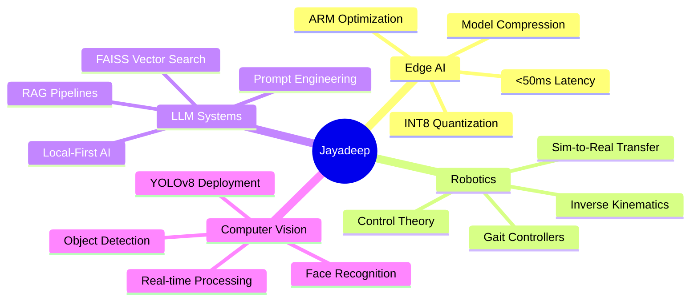

<div align="center">

# 👋 Hi, I'm Jayadeep Gowda


[](https://jayadeepgowda.vercel.app)
[](https://linkedin.com/in/jay7788)
[](mailto:jayadeepgowda24@gmail.com)
[](https://github.com/jay7-tech)

</div>

---


### 🚀 Quick Intro

**Robotics & AI Engineer** | **B.E. @ BIT Bangalore (8.8 CGPA)**

I build **production-ready AI systems** that run on edge devices. My work bridges the gap between cutting-edge research and real-world deployment — from multimodal AI agents to legged robot controllers.

🎯 **Recent Achievement:** 2nd place at National Robotics Expo (150+ teams)  
⚡ **Specialization:** Edge AI optimization (2.9× inference speedup on ARM)  
🤖 **Focus Areas:** Embodied AI, Computer Vision, LLM Systems, Robotics Control

<br clear="right"/>

---

## 🔬 What I'm Working On
```python
class Jayadeep:
    def __init__(self):
        self.current_projects = {
            "MEMO (Neural-OS)": "Production multimodal AI agent for edge devices",
            "Embodied AI Research": "Vision-Language-Action models for robotics",
            "Model Optimization": "INT8/4-bit quantization for ARM hardware"
        }
        
        self.looking_for = [
            "Research internships in AI/ML/Robotics",
            "Collaborations on multimodal systems",
            "Mentorship in embodied AI"
        ]
        
        self.tech_stack = {
            "AI/ML": ["PyTorch", "TensorFlow", "Scikit-learn"],
            "Computer Vision": ["YOLOv8", "OpenCV", "MediaPipe"],
            "LLMs": ["Phi-2", "Llama-3", "RAG", "FAISS"],
            "Robotics": ["ROS", "PyBullet", "IK Solvers", "FSM Controllers"],
            "Edge Deployment": ["ONNX", "TensorRT", "Quantization", "ARM NEON"]
        }
    
    def say_hi(self):
        print("Let's build intelligent systems that interact with the real world!")

me = Jayadeep()
me.say_hi()
```

---

## 🏆 Featured Projects

<div align="center">

### 🤖 [MEMO (Neural-OS)](https://github.com/jay7-tech/memo)
**Production Multimodal AI Agent for Edge Devices**

[](https://github.com/jay7-tech/memo)
[](https://github.com/jay7-tech/memo/fork)
```
🎯 2.9× inference speedup (160ms → 55ms)
🧠 Integrates YOLOv8, Whisper ASR, Phi-2 LLM, RAG
⚡ <50ms end-to-end latency on ARM
📊 98.4% uptime over 72-hour stress testing
```

<details>
<summary><b>🔍 Technical Deep Dive</b></summary>

**Architecture:**
- Real-time computer vision (YOLOv8 INT8)
- Speech recognition (Whisper Tiny)
- LLM reasoning (4-bit quantized Phi-2)
- Persistent memory (SQLite + FAISS RAG)
- Asynchronous pipeline (ZeroMQ IPC)

**Optimizations:**
- INT8 quantization via OpenVINO
- ARM NEON instruction vectorization
- Memory footprint: 3.2-3.8GB under peak load
- Parallel execution of 6 concurrent AI tasks

</details>

---

### 🧠 [Cognis](https://github.com/jay7-tech/cognis)
**LLM Optimization System with Temporal Pattern Analysis**
```
🎯 40-60% reduction in unproductive queries
🔍 Novel n-gram sequence mining algorithm
⚡ Sub-200ms FAISS vector search
🔒 Zero cloud dependency (local-first)
```

---

### 🛒 [YOLOmart](https://github.com/jay7-tech/Yolo_mart-main)
**Autonomous Retail Tracking with Embedded Vision**
```
🏆 2nd place - GlitchVerse 2k25 National Expo (150+ teams)
📹 20 FPS real-time inference at 92% mAP
🔋 8-hour battery operation
📱 Full-stack integration (mobile + cloud)
```

</div>

---

## 💻 Tech Stack

<div align="center">

### Languages & Core


### AI/ML & Deep Learning


### Robotics & Edge AI


### Frameworks & Tools


</div>

---

## 📊 GitHub Analytics

<div align="center">
  
  
</div>

<div align="center">
  
</div>

<div align="center">
  
</div>

---

## 🎯 Areas of Expertise

<table align="center">
<tr>
<td width="50%" valign="top">

### 🤖 Robotics & Control
- Inverse Kinematics (Jacobian-based)
- Finite State Machine Controllers
- Quadruped/Humanoid Locomotion
- Simulation (PyBullet, Gazebo)
- Sensor Fusion

</td>
<td width="50%" valign="top">

### 🧠 AI/ML Systems
- Large Language Models (LLMs)
- RAG Pipelines & Vector Databases
- Computer Vision (YOLO, R-CNN)
- Model Quantization (INT8/4-bit)
- Edge Deployment & Optimization

</td>
</tr>
</table>

---

## 📈 Contribution Graph

<div align="center">
  
[](https://github.com/jay7-tech)

</div>

---

## 💡 Ask Me About

<div align="center">


</div>

---

## 🤝 Let's Collaborate!

<div align="center">

I'm actively seeking **research internship opportunities** in:

🔬 **AI/ML Research Labs** | 🤖 **Robotics Centers** | 🏢 **Tech Companies**

**Interested in collaboration?** Let's discuss:
- Embodied AI & multimodal systems
- Legged robotics & control theory
- Edge AI deployment & optimization
- Vision-language models for robotics

<a href="mailto:jayadeepgowda24@gmail.com">
  
</a>

</div>

---

## ⚡ Fun Facts

<div align="center">

🏆 Secured **2nd place** at National Project Expo competing against **150+ teams**  
🎯 Built an AI system running **6 concurrent pipelines** on a **$50 Raspberry Pi**  
🎵 Debug faster when listening to **lo-fi hip hop** (still don't know why it works 🤷)  
🤖 Deployed **quadruped gait controllers** that actually walked on real hardware  
⚡ Achieved **2.9× inference speedup** through optimization wizardry  

</div>

---

<div align="center">

### 💭 Random Dev Wisdom


### 📊 Profile Views

[](https://visitcount.itsvg.in)

---


**"Building intelligent systems that bridge the gap between AI and the physical world"**

</div>

---

<!-- Crafted with ❤️ by Jayadeep Gowda -->
