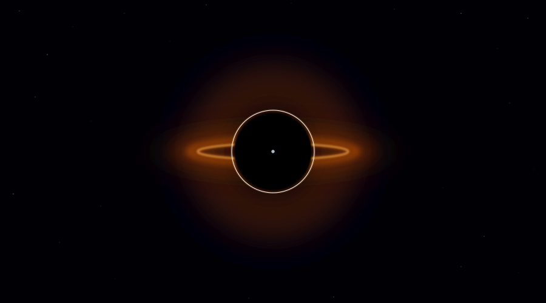

<br/>

<div align="center">



</div>

<br/>

<div align="center">


</div>

<br/>

---

<div align="center">

[](https://jayadeepgowda.vercel.app)&nbsp;
[](https://linkedin.com/in/jay7788)&nbsp;
[](mailto:jayadeepgowda24@gmail.com)

</div>

---

<br/>

**[MEMO — Neural-OS](https://github.com/jay7-tech/memo)** &nbsp;·&nbsp; multimodal desktop robot. six concurrent AI pipelines on a Raspberry Pi 5. no cloud.

**[Cognis](https://github.com/jay7-tech/cognis)** &nbsp;·&nbsp; LLM optimizer via n-gram pattern mining. cuts query load 40–60%. fully air-gapped.

**[RILA](https://github.com/jay7-tech/rila)** &nbsp;·&nbsp; turns videos into searchable memory. hybrid geo + semantic retrieval via telegram.

**[YOLOmart](https://github.com/jay7-tech/Yolo_mart-main)** &nbsp;·&nbsp; autonomous vision cart. 20fps real-time detection. 🥈 2nd / 150+ teams.

<br/>

---

<br/>

```
IISc Bangalore  ·  Research Intern, CDS          Mar – Jun 2026
Sirena AI       ·  R&D, Robotics & Edge AI       Jan – Feb 2026
Frillory        ·  AI Automation Engineer         Jun – Aug 2025
```

<br/>

---

<div align="center">


&nbsp;


</div>

<br/>


